# 🏗️ GTS Platform Data Architecture & Connectivity Diagram

## 📋 Обзор системы
Диаграмма показывает полную архитектуру данных платформы Grand Tour Sochi, включая все модули, порталы, потоки данных и взаимосвязи между компонентами.

```mermaid
graph TB
    %% === 🎯 CORE ENTRY POINTS ===
    App[🚀 App.tsx<br/>Main Entry Point]
    Router[🧭 GTSPageRouter<br/>Navigation Hub]
    Auth[🔐 AuthContext<br/>Authentication]
    
    App --> Auth
    App --> Router
    Auth --> Router

    %% === 🌐 USER PORTALS ===
    subgraph "👥 USER PORTALS"
        ExecutivePortal[👑 Executive Portal<br/>GTSExecutivePanel_v2025]
        PartnerPortal[🤝 Partner Portal<br/>GTSPartnerPortalUnified]
        ClientPortal[💎 Client Club Portal<br/>GTSClientClubPortal]
        B2BPortal[🏢 B2B Client Portal<br/>GTSB2BClientPortal]
        CrewApp[⚡ Crew Mobile App<br/>GTSCrewApp]
        ContractorPortal[🔧 Contractor Portal<br/>GTSContractorPortal]
        BrandPartnerPortal[🎨 Brand Partner Portal<br/>GTSBrandPartnerPortal]
    end

    Router --> ExecutivePortal
    Router --> PartnerPortal
    Router --> ClientPortal
    Router --> B2BPortal
    Router --> CrewApp
    Router --> ContractorPortal
    Router --> BrandPartnerPortal

    %% === 📊 CORE BUSINESS MODULES ===
    subgraph "💼 CORE BUSINESS MODULES"
        CRM[👥 CRM System<br/>GTSCRMSystem]
        Finance[💰 Finance System<br/>GTSFinanceSystem]
        Booking[📅 Booking Calendar<br/>GTSGlobalBookingCalendar]
        Dispatch[🚁 Dispatch Module<br/>GTSDispatchModule]
        Fleet[🚗 Fleet Maintenance<br/>GTSFleetMaintenanceModule]
        Inventory[📦 Inventory & Parts<br/>GTSInventoryPartsModule]
        Pricing[💵 Pricing & Offers<br/>GTSPricingOffersModule]
        Routes[🗺️ Routes & Schedules<br/>GTSRoutesSchedulesModule]
    end

    ExecutivePortal --> CRM
    ExecutivePortal --> Finance
    ExecutivePortal --> Booking
    ExecutivePortal --> Dispatch
    ExecutivePortal --> Fleet
    ExecutivePortal --> Inventory
    ExecutivePortal --> Pricing
    ExecutivePortal --> Routes

    %% === 🤖 AI & AUTOMATION ===
    subgraph "🤖 AI & AUTOMATION LAYER"
        AIAssistant[🧠 Global AI Assistant<br/>GTSGlobalAIAssistant]
        AIContent[✍️ AI Content Generator<br/>GTSAIContentGenerator]
        AIInsights[📈 AI Customer Insights<br/>GTSAICustomerInsights]
        AIMarket[📊 AI Market Analysis<br/>GTSAIMarketAnalysis]
        OmniInbox[📨 Omni Inbox<br/>GTSOmniInboxModule]
    end

    CRM --> AIAssistant
    CRM --> AIContent
    CRM --> AIInsights
    Finance --> AIMarket
    ExecutivePortal --> OmniInbox

    %% === 🛠️ SUPPORT MODULES ===
    subgraph "🛠️ SUPPORT & MANAGEMENT"
        IAM[🔒 Identity & Access<br/>GTSIAMRolesPermissions]
        Sphere[🌐 Sphere Management<br/>GTSSphereManagement]
        CMS[📝 Content Management<br/>GTSCMSSystem]
        Analytics[📊 Analytics Enhanced<br/>GTSAnalyticsEnhanced]
        Audit[📋 Audit Logging<br/>GTSAuditLoggingModule]
        API[🔌 API Integrations<br/>GTSAPIIntegrationsModule]
        Notifications[🔔 Notifications<br/>GTSNotificationsPanel]
    end

    ExecutivePortal --> IAM
    ExecutivePortal --> Sphere
    ExecutivePortal --> CMS
    ExecutivePortal --> Analytics
    ExecutivePortal --> Audit
    ExecutivePortal --> API
    ExecutivePortal --> Notifications

    %% === 📱 MOBILE & SPECIALIZED ===
    subgraph "📱 MOBILE & SPECIALIZED"
        MobileBooking[📱 Mobile Booking<br/>GTSGlobalBookingCalendarMobile]
        CrewMobile[👷 Crew Mobile<br/>GTSCrewAppMobile]
        MobileNav[📱 Mobile Navigation<br/>GTSCrewMobileBottomNav]
        ResourcePlanning[📋 Resource Planning<br/>GTSResourcePlanningPanel]
    end

    Booking --> MobileBooking
    CrewApp --> CrewMobile
    CrewApp --> MobileNav
    ExecutivePortal --> ResourcePlanning

    %% === 🏢 PARTNER ECOSYSTEM ===
    subgraph "🤝 PARTNER ECOSYSTEM"
        PartnersDB[🗄️ Partners Database<br/>GTSPartnersDatabase]
        PartnersModule[🤝 Partners Management<br/>GTSPartnersModule]
        PartnerAgent[🎯 Partner Agent<br/>GTSPartnerAgent*]
        BrandTools[🎨 Brand Partner Tools<br/>GTSBrandPartnerTools]
        ContractorFleet[🚛 Contractor Fleet<br/>GTSContractorFleet]
    end

    PartnerPortal --> PartnersDB
    PartnerPortal --> PartnersModule
    PartnerPortal --> PartnerAgent
    BrandPartnerPortal --> BrandTools
    ContractorPortal --> ContractorFleet

    %% === 🎓 CLIENT SERVICES ===
    subgraph "💎 CLIENT SERVICES"
        ClientClub[👑 Client Club<br/>GTSClientClub]
        Loyalty[🏆 Loyalty Program<br/>GTSClientClubLoyalty]
        Concierge[🎩 Concierge Service<br/>GTSConciergeModule]
        VIPBookings[⭐ VIP Bookings<br/>GTSVIPBookingsComponent]
        Corporate[🏢 Corporate Clients<br/>GTSCorporateClientsModule]
    end

    ClientPortal --> ClientClub
    ClientPortal --> Loyalty
    ClientPortal --> Concierge
    ClientPortal --> VIPBookings
    B2BPortal --> Corporate

    %% === 📚 SHARED INFRASTRUCTURE ===
    subgraph "🔗 SHARED INFRASTRUCTURE"
        SharedModules[🔧 Shared Modules<br/>GTSSharedModules]
        SharedStates[💾 Shared States<br/>GTSSharedStates]
        SharedDocs[📄 Shared Documents<br/>GTSSharedDocuments]
        SharedAudit[📊 Shared Audit<br/>GTSSharedAudit]
        UIKit[🎨 UI Kit<br/>GTSUIKit]
        AppShell[🏗️ App Shell<br/>GTSUnifiedAppShell]
    end

    %% All portals connect to shared infrastructure
    ExecutivePortal --> SharedModules
    PartnerPortal --> SharedModules
    ClientPortal --> SharedModules
    B2BPortal --> SharedModules
    CrewApp --> SharedModules

    SharedModules --> SharedStates
    SharedModules --> SharedDocs
    SharedModules --> SharedAudit
    SharedModules --> UIKit
    SharedModules --> AppShell

    %% === 💾 DATA LAYER ===
    subgraph "💾 DATA & PERSISTENCE"
        MockData[🎭 Mock Data<br/>useMockData]
        LocalStorage[💾 LocalStorage<br/>Browser Storage]
        DatabaseAdapter[🗄️ Database Adapter<br/>DatabaseAdapter]
        BookingSystem[📅 Booking System<br/>useBookingSystem]
    end

    %% Data connections
    CRM --> MockData
    Finance --> MockData
    Booking --> BookingSystem
    Auth --> LocalStorage
    SharedStates --> DatabaseAdapter

    %% === 🔄 UTILITIES & HELPERS ===
    subgraph "🔄 UTILITIES & HELPERS"
        Navigation[🧭 Navigation Utils<br/>navigation.ts]
        AINavigation[🤖 AI Navigation<br/>ai-navigation-map.ts]
        GTSStyles[🎨 GTS Styles<br/>gts-styles.ts]
        CleanupManager[🧹 Cleanup Manager<br/>cleanup-manager.ts]
    end

    Router --> Navigation
    Router --> AINavigation
    UIKit --> GTSStyles
    SharedModules --> CleanupManager

    %% === 🎯 STYLING & THEMING ===
    subgraph "🎨 STYLING SYSTEM"
        DesignTokens[🎨 Design Tokens<br/>design-tokens.css]
        GlobalCSS[🌐 Global CSS<br/>globals.css]
        GTSTheme[🎯 GTS Theme<br/>withGTSTheme]
    end

    UIKit --> DesignTokens
    UIKit --> GlobalCSS
    UIKit --> GTSTheme

    %% === 📊 DATA FLOW PATTERNS ===
    
    %% CRM Data Flow
    CRM -.->|Lead Data| Booking
    CRM -.->|Customer Data| Finance
    CRM -.->|Analytics| AIInsights
    
    %% Finance Data Flow  
    Finance -.->|Payment Data| Booking
    Finance -.->|Revenue Data| Analytics
    Finance -.->|Pricing Data| Pricing
    
    %% Fleet & Operations Flow
    Fleet -.->|Vehicle Data| Dispatch
    Fleet -.->|Maintenance Data| Inventory
    Dispatch -.->|Route Data| Routes
    Routes -.->|Schedule Data| Booking
    
    %% Partner Data Flow
    PartnersDB -.->|Partner Data| CRM
    PartnersDB -.->|Commission Data| Finance
    
    %% Client Data Flow
    ClientClub -.->|Member Data| CRM
    Loyalty -.->|Points Data| Finance
    Corporate -.->|B2B Data| CRM

    %% === 🎯 USER ROLE FLOW ===
    subgraph "👤 USER ROLES & ACCESS"
        Executive[👑 Executive Role]
        Partner[🤝 Partner Role]
        Client[💎 Client Role]
        Staff[👷 Staff Role]
        Crew[⚡ Crew Role]
    end

    Executive --> ExecutivePortal
    Partner --> PartnerPortal
    Client --> ClientPortal
    Staff --> B2BPortal
    Crew --> CrewApp

    %% Style definitions
    classDef coreModule fill:#91040C,stroke:#fff,stroke-width:2px,color:#fff
    classDef aiModule fill:#4f46e5,stroke:#fff,stroke-width:2px,color:#fff
    classDef portal fill:#059669,stroke:#fff,stroke-width:2px,color:#fff
    classDef shared fill:#7c3aed,stroke:#fff,stroke-width:2px,color:#fff
    classDef data fill:#dc2626,stroke:#fff,stroke-width:2px,color:#fff
    classDef utility fill:#0891b2,stroke:#fff,stroke-width:2px,color:#fff

    class CRM,Finance,Booking,Dispatch,Fleet,Inventory,Pricing,Routes coreModule
    class AIAssistant,AIContent,AIInsights,AIMarket,OmniInbox aiModule
    class ExecutivePortal,PartnerPortal,ClientPortal,B2BPortal,CrewApp portal
    class SharedModules,SharedStates,UIKit,AppShell shared
    class MockData,LocalStorage,DatabaseAdapter,BookingSystem data
    class Navigation,AINavigation,GTSStyles,CleanupManager utility
```



## 🔄 Ключевые потоки данных

### 1. 👑 Executive Flow
```
Executive Portal → All Core Modules → Shared Infrastructure → Data Layer
```

### 2. 🤝 Partner Flow  
```
Partner Portal → Partners DB → CRM → Finance (Commissions)
```

### 3. 💎 Client Flow
```
Client Portal → Client Club → Loyalty → Booking → Finance
```

### 4. ⚡ Operations Flow
```
Dispatch → Fleet → Routes → Booking → Customer Delivery
```

### 5. 🤖 AI Intelligence Flow
```
CRM Data → AI Insights → Content Generation → Customer Engagement
```

## 📊 Архитектурные слои

### 🎯 **Layer 1: Entry & Authentication**
- `App.tsx` - главная точка входа
- `AuthContext` - управление аутентификацией
- `GTSPageRouter` - маршрутизация по ролям

### 🌐 **Layer 2: User Portals**
- Executive Portal (все модули)
- Partner Portal (управление партнерами)
- Client Portal (клубные сервисы)
- B2B Portal (корпоративные клиенты)
- Crew App (мобильные операции)

### 💼 **Layer 3: Core Business Logic**
- CRM (клиенты, лиды, продажи)
- Finance (платежи, отчеты, комиссии)
- Booking (бронирования, календарь)
- Operations (диспетчеризация, флот, маршруты)

### 🤖 **Layer 4: AI & Automation**
- Global AI Assistant
- Content Generation
- Customer Insights
- Market Analysis

### 🔗 **Layer 5: Shared Infrastructure**
- UI Components (GTSUIKit)
- Shared States & Data
- Authentication & Authorization
- Audit & Logging

### 💾 **Layer 6: Data Persistence**
- Mock Data System
- Local Storage
- Database Adapters
- Booking System

## 🔐 Роли и доступы

| Роль | Портал | Доступные модули |
|------|--------|------------------|
| **Executive** | Executive Portal | Все модули (CRM, Finance, Fleet, etc.) |
| **Partner** | Partner Portal | Partners DB, Commissions, Marketing |
| **Client** | Client Club | Bookings, Loyalty, Concierge |
| **B2B Manager** | B2B Portal | Corporate Clients, Contracts |
| **Crew** | Mobile App | Operations, Dispatch, Routes |
| **Staff** | Various | Role-specific access |

## 🔄 Интеграционные точки

### 📊 **CRM Integration Points**
- Finance (revenue tracking)
- Booking (customer reservations)
- Partners (referrals & commissions)
- AI Insights (behavior analysis)

### 💰 **Finance Integration Points**
- CRM (customer payments)
- Partners (commission calculations)
- Pricing (dynamic pricing)
- Analytics (revenue reporting)

### 📅 **Booking Integration Points**
- CRM (customer data)
- Routes (schedule optimization)
- Fleet (vehicle availability)
- Pricing (dynamic rates)

### 🚁 **Operations Integration Points**
- Dispatch ↔ Fleet ↔ Routes
- Inventory ↔ Maintenance
- Crew App ↔ Operations Data

## 🎯 Критические зависимости

### 🔴 **High Priority Dependencies**
1. `AuthContext` → All Portals
2. `SharedModules` → All Business Logic
3. `GTSUIKit` → All UI Components
4. `MockData` → All Business Modules

### 🟡 **Medium Priority Dependencies**
1. `AI Modules` → `CRM Data`
2. `Analytics` → `All Business Data`
3. `Notifications` → `All User Actions`

### 🟢 **Low Priority Dependencies**
1. `Cleanup Manager` → `Temporary Files`
2. `Style System` → `UI Consistency`
3. `Demo Router` → `Development`

## 📈 Масштабируемость

### 🔄 **Horizontal Scaling Points**
- Каждый портал может разрабатываться независимо
- AI модули изолированы и расширяемы
- Shared Infrastructure поддерживает новые модули

### 📊 **Performance Considerations**
- Lazy loading для портлов
- Мемоизация для SharedStates
- Виртуализация для больших списков

### 🔮 **Future Extensions**
- Новые AI модули
- Дополнительные порталы
- Расширенная аналитика
- Мобильные приложения

---

## 🏗️ Техническая архитектура

Платформа построена по модульному принципу с четким разделением ответственности:

- **Frontend-only** архитектура с мок-данными
- **Role-based** доступ через порталы
- **AI-enhanced** навигация и автоматизация
- **Shared** инфраструктура для переиспользования
- **Responsive** дизайн для всех устройств

Это обеспечивает высокую гибкость, масштабируемость и простоту поддержки всей экосистемы GTS.