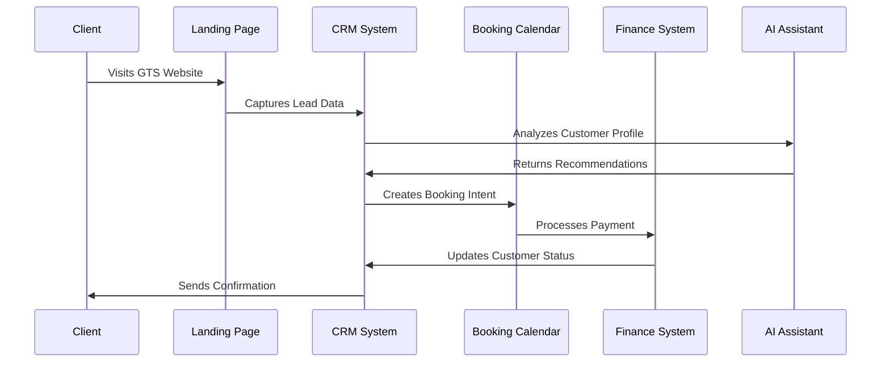
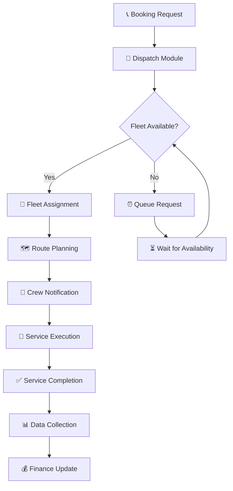
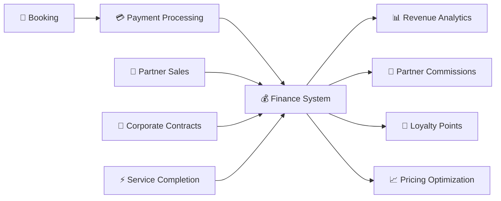
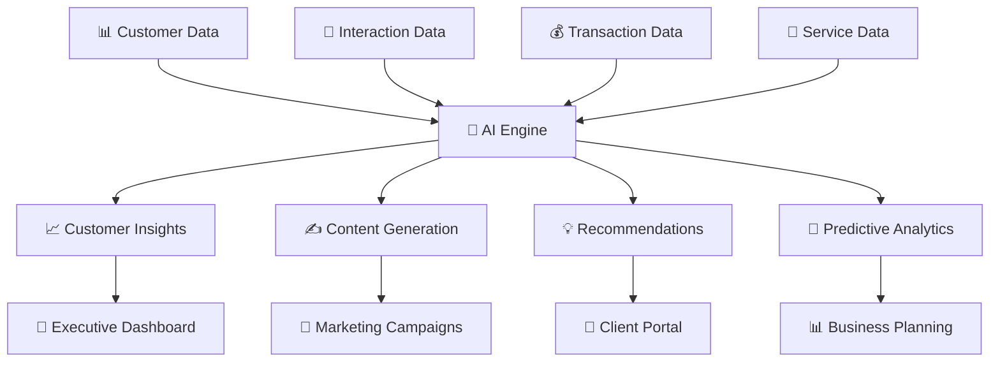

# 🔄 GTS Platform - Анализ потоков данных

## 📊 Критические потоки данных

### 1. 🎯 Основной Customer Journey Flow



### 2. 🚁 Operations Flow (Dispatch → Fleet → Routes)



### 3. 💰 Financial Data Integration



### 4. 🤖 AI Data Processing Pipeline



## 🔄 Межмодульные зависимости

### 📋 Dependency Matrix

| Module | CRM | Finance | Booking | Fleet | Partners | AI |
|--------|-----|---------|---------|-------|----------|-----|
| **CRM** | - | ✅ Customer Data | ✅ Booking Requests | ❌ | ✅ Referrals | ✅ Analytics |
| **Finance** | ✅ Payments | - | ✅ Pricing | ✅ Costs | ✅ Commissions | ✅ Forecasting |
| **Booking** | ✅ Customer Info | ✅ Payment Status | - | ✅ Vehicle Schedule | ❌ | ✅ Optimization |
| **Fleet** | ❌ | ✅ Maintenance Costs | ✅ Availability | - | ✅ External Fleet | ✅ Predictive Maintenance |
| **Partners** | ✅ Lead Generation | ✅ Commission Tracking | ❌ | ✅ Fleet Sharing | - | ✅ Performance Analysis |
| **AI** | ✅ Customer Insights | ✅ Financial Forecasting | ✅ Demand Prediction | ✅ Maintenance Prediction | ✅ Performance Optimization | - |

### 🎯 Critical Data Dependencies

#### 🔴 **High Criticality** (System cannot function without)
1. **Auth → All Portals** - Authentication required for access
2. **CRM → Booking** - Customer data required for reservations
3. **Finance → Booking** - Payment processing essential
4. **Fleet → Dispatch** - Vehicle availability critical for operations

#### 🟡 **Medium Criticality** (Degraded functionality)
1. **AI → CRM** - Insights enhance but not required
2. **Partners → Finance** - Commissions can be calculated later
3. **Analytics → All Modules** - Reporting can be delayed

#### 🟢 **Low Criticality** (Nice to have)
1. **Notifications → All Modules** - Can use alternatives
2. **Audit → All Modules** - Can be asynchronous
3. **CMS → Marketing** - Content can be static

## 📊 Модель данных

### 🏗️ Core Data Entities

```typescript
// Core Business Entities
interface Customer {
  id: string
  profile: CustomerProfile
  bookings: Booking[]
  loyaltyPoints: number
  preferences: CustomerPreferences
}

interface Booking {
  id: string
  customerId: string
  serviceType: ServiceType
  schedule: BookingSchedule
  pricing: PricingDetails
  status: BookingStatus
}

interface Vehicle {
  id: string
  type: VehicleType
  status: VehicleStatus
  maintenance: MaintenanceRecord[]
  currentLocation: Location
}

interface Partner {
  id: string
  type: PartnerType
  commissionRate: number
  performance: PartnerMetrics
  contracts: Contract[]
}

// AI-Enhanced Entities
interface CustomerInsight {
  customerId: string
  preferences: AIPreferences
  predictedValue: number
  churnRisk: number
  recommendations: Recommendation[]
}

interface BusinessIntelligence {
  metrics: KPIMetrics
  forecasts: BusinessForecast[]
  recommendations: BusinessRecommendation[]
  alerts: BusinessAlert[]
}
```

### 🔄 Data Flow Patterns

#### 1. **Event-Driven Architecture**
```typescript
// Event Bus Pattern
interface GTSEvent {
  type: string
  data: any
  timestamp: Date
  source: string
}

// Example Events
type BookingCreated = GTSEvent & {
  type: 'booking.created'
  data: Booking
}

type PaymentProcessed = GTSEvent & {
  type: 'payment.processed'  
  data: PaymentDetails
}
```

#### 2. **State Management Pattern**
```typescript
// Global State Structure
interface GTSGlobalState {
  auth: AuthState
  user: UserState
  booking: BookingState
  finance: FinanceState
  fleet: FleetState
  partners: PartnerState
  ai: AIState
}

// Shared State Actions
type GTSAction = 
  | { type: 'UPDATE_USER_PROFILE', payload: UserProfile }
  | { type: 'CREATE_BOOKING', payload: BookingRequest }
  | { type: 'PROCESS_PAYMENT', payload: PaymentRequest }
  | { type: 'UPDATE_FLEET_STATUS', payload: FleetUpdate }
```

#### 3. **Data Synchronization Pattern**
```typescript
// Sync Manager for Cross-Module Data
class GTSDataSyncManager {
  syncCustomerData(customerId: string): Promise<void>
  syncBookingData(bookingId: string): Promise<void>  
  syncFinanceData(period: DateRange): Promise<void>
  syncFleetData(vehicleId: string): Promise<void>
}
```

## 🎯 Performance Optimization Patterns

### ⚡ Data Loading Strategies

#### 1. **Lazy Loading by Portal**
```typescript
// Portal-specific data loading
const ExecutivePortal = lazy(() => import('./GTSExecutivePanel_v2025'))
const PartnerPortal = lazy(() => import('./GTSPartnerPortalUnified'))
const ClientPortal = lazy(() => import('./GTSClientClubPortal'))
```

#### 2. **Incremental Data Fetching**
```typescript
// Progressive data loading
interface DataLoadingStrategy {
  immediate: string[]    // Critical data loaded first
  deferred: string[]     // Non-critical data loaded later
  onDemand: string[]     // Data loaded when needed
}

const ExecutiveDashboardStrategy: DataLoadingStrategy = {
  immediate: ['user_profile', 'recent_bookings', 'alerts'],
  deferred: ['analytics', 'reports', 'partner_data'],
  onDemand: ['detailed_reports', 'historical_data']
}
```

#### 3. **Caching Strategies**
```typescript
// Multi-level caching
interface GTSCacheStrategy {
  memory: MemoryCache      // In-memory cache for active data
  storage: LocalStorage    // Browser storage for session data
  indexed: IndexedDB       // Large data storage
}
```

## 🔒 Data Security & Access Control

### 🛡️ Role-Based Data Access

```typescript
// Data access permissions by role
interface DataAccessMatrix {
  [role: string]: {
    read: string[]
    write: string[]
    delete: string[]
  }
}

const AccessMatrix: DataAccessMatrix = {
  executive: {
    read: ['*'],
    write: ['*'],
    delete: ['audit_logs', 'system_config']
  },
  partner: {
    read: ['own_data', 'commission_data', 'partner_metrics'],
    write: ['partner_profile', 'marketing_content'],
    delete: []
  },
  client: {
    read: ['own_bookings', 'loyalty_data', 'profile'],
    write: ['profile', 'preferences'],
    delete: []
  }
}
```

### 🔐 Data Encryption & Privacy

```typescript
// Data privacy levels
enum DataPrivacyLevel {
  PUBLIC = 'public',
  INTERNAL = 'internal', 
  CONFIDENTIAL = 'confidential',
  RESTRICTED = 'restricted'
}

interface DataClassification {
  entity: string
  privacyLevel: DataPrivacyLevel
  retentionPeriod: number
  encryptionRequired: boolean
}
```

## 📈 Scaling Considerations

### 🔄 Horizontal Scaling Points

1. **Portal Isolation**
   - Each portal can scale independently
   - Separate deployment pipelines
   - Isolated state management

2. **Module Federation**
   - Business modules as micro-frontends
   - Independent versioning
   - Runtime composition

3. **Data Partitioning**
   - Customer data by region
   - Partner data by type
   - Historical data archiving

### 📊 Performance Monitoring

```typescript
// Performance metrics tracking
interface PerformanceMetrics {
  dataLoadTime: number
  renderTime: number
  memoryUsage: number
  errorRate: number
  userInteractions: InteractionMetric[]
}

// Critical performance thresholds
const PerformanceThresholds = {
  dataLoadTime: 2000,    // 2 seconds max
  renderTime: 100,       // 100ms max
  memoryUsage: 50,       // 50MB max
  errorRate: 0.01        // 1% max
}
```

---

## 🎯 Заключение

Платформа GTS построена на принципах:

- **🔄 Модульность** - независимые, переиспользуемые модули
- **🎯 Роль-ориентированность** - данные и доступ по ролям
- **🤖 AI-интеграция** - умная обработка и анализ данных  
- **⚡ Производительность** - оптимизированные потоки данных
- **🔒 Безопасность** - контролируемый доступ к данным
- **📈 Масштабируемость** - горизонтальное масштабирование

Эта архитектура обеспечивает гибкость разработки, простоту поддержки и высокую производительность для всех пользователей платформы.